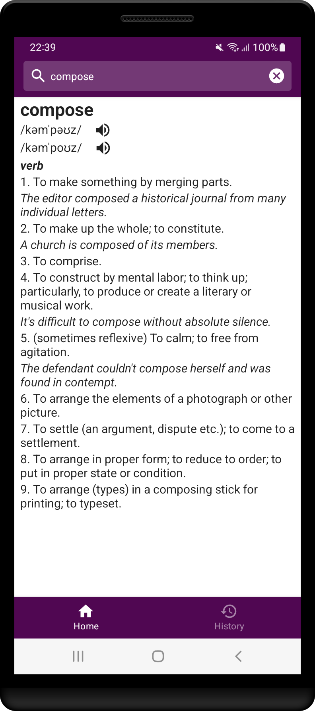

# DictionaryApp

Used Free Dictionary API: https://dictionaryapi.dev/

Jetpack Compose, MVVM, Navigating, Hilt, Room, Gson, Ktor.

From search screen successfully found words are saved in database. Audio can be played.

From search history screen can navigate back to search screen, can tap on history item to go to search screen with setting in search field tapped value, can delete all search history.

 
